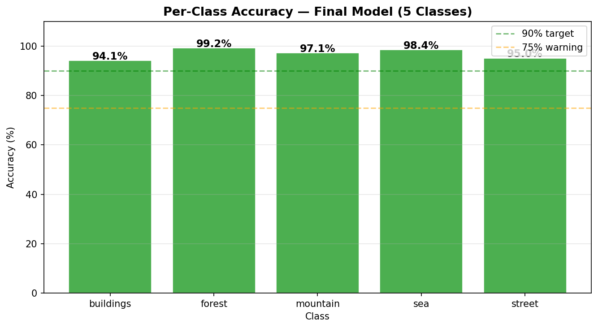
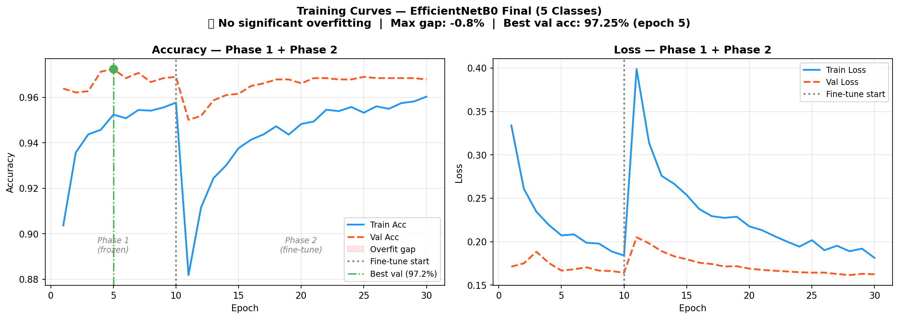
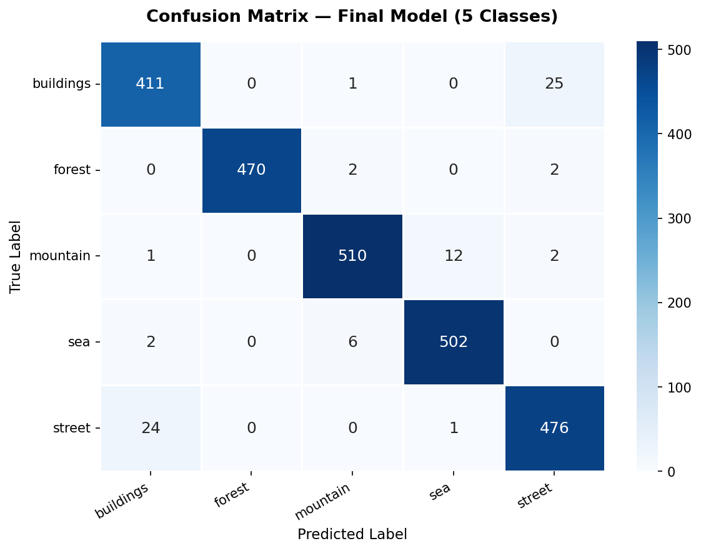

# 🏷️ Task 1 — Image Tagging with TensorFlow

<p align="center">
  
</p>

---

## 📋 Objective
Develop a model for **image tagging** using TensorFlow that automatically 
classifies natural scene images into predefined categories.

---

## 🎯 Final Results

<p align="center">

| Metric | Score |
|:---:|:---:|
| ✅ **Accuracy** | **96.81%** |
| ✅ **Precision** | **96.83%** |
| ✅ **Recall** | **96.81%** |
| ✅ **F1-Score** | **96.82%** |

</p>

---

## 🏷️ Classes & Per-Class Accuracy

| # | Class | Accuracy | Status |
|:---:|:---:|:---:|:---:|
| 1 | 🏢 Buildings | 94.1% | ✅ |
| 2 | 🌲 Forest | 99.2% | ✅ |
| 3 | ⛰️ Mountain | 97.1% | ✅ |
| 4 | 🌊 Sea | 98.4% | ✅ |
| 5 | 🛣️ Street | 95.0% | ✅ |

> ✅ All 5 classes above 94% — No weak class!

---

## 🗂️ Project Pipeline

```
📥 Data Preparation
      ↓
🔄 Data Augmentation
      ↓
🏗️ Model Architecture (EfficientNetB0)
      ↓
🎯 Phase 1 Training (Frozen Backbone)
      ↓
🔧 Phase 2 Fine-Tuning (Top 50 Layers)
      ↓
📊 Model Evaluation
      ↓
🚀 Deployment
```

---

## 🤖 Model Architecture

```
Input (224×224×3)
      ↓
EfficientNetB0 (ImageNet pretrained — backbone)
      ↓
GlobalAveragePooling2D
      ↓
BatchNormalization
      ↓
Dropout (0.4)
      ↓
Dense (256, ReLU) + L2 regularization
      ↓
BatchNormalization
      ↓
Dropout (0.2)
      ↓
Dense (128, ReLU) + L2 regularization
      ↓
Dropout (0.1)
      ↓
Dense (5, Softmax) ← Output
```

---

## 📦 Dataset

- **Name**    : Intel Image Classification
- **Classes** : 5 (buildings, forest, mountain, sea, street)
- **Train**   : ~11,900 images
- **Test**    : ~2,447 images
- **Source**  : [Kaggle — Intel Image Classification](https://www.kaggle.com/datasets/puneet6060/intel-image-classification)

> ⚠️ Glacier class was removed after analysis — it caused visual overlap with mountain class

---

## 📊 Training Details

| Setting | Value |
|---|---|
| Backbone | EfficientNetB0 |
| Image Size | 224 × 224 |
| Batch Size | 32 |
| Phase 1 Epochs | 15 (frozen) |
| Phase 2 Epochs | 20 (fine-tune) |
| Optimizer | Adam |
| Phase 1 LR | 1e-3 |
| Phase 2 LR | 1e-5 |
| Dropout | 0.4 → 0.2 → 0.1 |
| Best Val Accuracy | 97.25% (epoch 5) |
| Overfitting | ✅ None (gap = -0.76%) |

---

## 📈 Training Curves

<p align="center">
  
</p>

---

## 🔀 Confusion Matrix

<p align="center">
  
</p>

---

## 🖼️ Sample Predictions

<p align="center">
  
</p>

---

## 📁 Folder Structure

```
Task1/
│
├── 📓 Final_Model.ipynb          ← Full training notebook
│
├── 📁 Model/
│   └── best_model_final.keras    ← Best saved model (97.25% val acc)
│
├── 📁 Pred_Img/
│   └── predictions_segpred.png   ← Prediction visualization
│
├── 📁 figures_final/
│   ├── class_distribution.png
│   ├── sample_images.png
│   ├── augmentation_preview.png
│   ├── training_curves.png
│   ├── confusion_matrix.png
│   └── per_class_accuracy.png
│
└── 📄 README.md                  ← You are here!
```

---

## 🚀 How to Load & Use the Model

```python
import tensorflow as tf
import numpy as np
from tensorflow.keras.applications.efficientnet import preprocess_input

# Load model
model = tf.keras.models.load_model('Model/best_model_final.keras')

# Class names
CLASSES = ['buildings', 'forest', 'mountain', 'sea', 'street']

# Predict a single image
def predict(img_path):
    img = tf.keras.utils.load_img(img_path, target_size=(224, 224))
    arr = tf.keras.utils.img_to_array(img)
    arr = preprocess_input(arr)
    arr = np.expand_dims(arr, axis=0)
    probs     = model.predict(arr, verbose=0)[0]
    predicted = CLASSES[np.argmax(probs)]
    confidence = round(float(np.max(probs)) * 100, 2)
    return predicted, confidence

# Example
tag, conf = predict('your_image.jpg')
print(f'Predicted: {tag}  ({conf}%)')
```

---

## 🛠️ Tech Stack


```
Python 3.9+
TensorFlow 2.x / Keras
EfficientNetB0 (Transfer Learning)
scikit-learn
NumPy, Pandas
Matplotlib, Seaborn
```

---

## 👤 Author

**Abdul Hafeez**
> Project submitted as part of **ShadowFox Internship Program**

---

<p align="center">
  <b>⭐ Star this repo if you found it helpful!</b>
</p>
